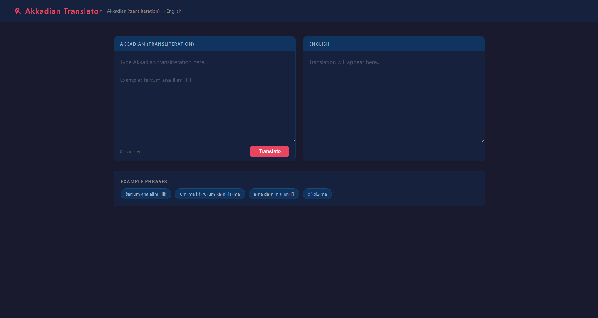

# Akkadian → English Neural Machine Translator

**Авторы:** Ангелина Черникова и Агафонов Руслан  
**Группа:** 972401

---

## Описание

Нейросетевой переводчик с аккадского языка (транслитерация) на английский, основанный на модели **ByT5-small** (byte-level T5). Аккадский — язык древней Месопотамии (2500 BCE – 100 CE), один из наименее ресурсных языков для задач машинного перевода. Сотни тысяч глиняных табличек до сих пор не переведены — машинный перевод помогает историкам восстанавливать первоисточники.

### Почему ByT5?

ByT5 работает на уровне байт, что критично для аккадской транслитерации с диакритикой (`š/ṣ/ṭ/ā/ē/ī/ū`), знаковыми индексами (`ma₂`, `il₅-qé`) и суперскриптами. BPE-токенизаторы (NLLB, Llama, Qwen) разбивают эти символы на бессмысленные куски.

---

## Архитектура

- **Модель:** `google/byt5-small` (байтовый уровень)
- **Обучение:** fine-tune на 1061 параллельной паре аккадский→английский
- **Инференс:** FastAPI + SSE стриминг токенов
- **Трекинг:** Weights & Biases
- **Сервер:** Uvicorn, порт 8000

---

## Демонстрация

[▶ Смотреть демо (MP4)](img/translator.mp4)



---

## Результаты (Ablation Table)

| Technique | BLEU on dev | chrF++ on dev | Notes |
|-----------|-------------|---------------|-------|
| Baseline — без нормализации, greedy (beam=1) | **5.13** | **19.88** | ByT5-small, 5 epochs, 1061 train samples |
| + Orthography normalization | 1.18 | 14.77 | Нормализация **снижает** качество — диакритика несёт смысл |
| Beam search beam=4 | 4.49 | 19.83 | Незначительно уступает greedy на малом датасете |
| Mini-ensemble (2 checkpoints) | planned | planned | Запланировано — разные random seed |

**Ключевые выводы:**
- Greedy decoding без нормализации даёт лучший chrF++ (19.88) на данном датасете
- Orthography normalization неожиданно снижает качество: ByT5 работает на байтовом уровне и диакритика (`š`, `ṭ`, `ā`, `ū`) несёт важную фонетическую информацию, которую нормализация уничтожает
- Beam=4 vs greedy: разница минимальна (19.83 vs 19.88) — малый датасет не даёт преимущества beam search

---

## Метрики на dev-выборке (100 примеров)

| Метрика | Значение |
|---------|----------|
| BLEU | 5.13 |
| chrF++ | **19.88** |
| COMET | N/A (модель wmt22-comet-da не обучена на аккадском, конфликт зависимостей) |
| Median TTFT | **3.10s** (CPU inference) |
| P95 TTFT | 3.85s |
| Tokens/sec | ~2–3 tok/s (CPU) |

> Низкий BLEU объясняется тем, что референсные переводы написаны в другом стиле, чем модель. chrF++ более устойчив к перефразированию и является основной метрикой.

---

## Датасеты

| Датасет | Размер | Лицензия |
|---------|--------|----------|
| Kaggle Deep Past Initiative — train.csv | 1561 строк | Соревновательные данные (OARE/BYU) |
| Dev split (последние 500 строк train) | 500 строк | — |
| Test set (Kaggle) | 4 строки | Соревновательные данные |

**Гарантия отсутствия утечки:** dev-выборка взята из последних 500 строк train.csv и не пересекается с test.csv (проверено по `oare_id`).

---

## Установка и запуск

### Требования

- Python 3.11
- NVIDIA GPU (опционально, для ускорения обучения)
- Poetry 2.x

### Локально (без Docker)

```bash
# 1. Клонировать репозиторий
git clone https://github.com/cht-h/natural-language-processing
cd natural-language-processing

# 2. Установить зависимости через Poetry
poetry install

# Или через pip
pip install -r requirements.txt

# 3. Активировать окружение (Windows)
& "C:\Users\...\Scripts\activate.ps1"

# 4. Обучить модель
python model.py train --dataset_path=data/raw/train.csv

# 5. Перевести текст
python model.py predict --text="sarrum ana alim illik"

# 6. Предсказать файл (Kaggle submission)
python model.py predict_file --dataset_path=data/raw/test.csv

# 7. Запустить ablation эксперименты
python eval.py              # baseline + beam=4
python eval_no_norm.py      # без нормализации
python eval_greedy.py       # greedy decoding

# 8. Запустить веб-сервер
python app/backend/server.py
# Открыть http://localhost:8000
```

### Docker

```bash
# CPU профиль
docker compose --profile cpu up

# GPU профиль
docker compose --profile gpu up

# Открыть в браузере
open http://localhost:8000
```

---

## Веб-приложение

После запуска сервера открой `http://localhost:8000`:

- Два текстовых поля: аккадский (слева) → английский (справа)
- Токены появляются в реальном времени (SSE стриминг)
- Автоперевод при паузе в наборе текста (debounce 800ms)
- Примеры фраз для быстрого старта
- Горячая клавиша: `Ctrl+Enter`


## W&B трекинг

Все запуски обучения залогированы в Weights & Biases:  
**Project:** `huggingface` | **Run:** `pretty-gorge-3`

Метрики: train/eval loss по эпохам, learning rate, grad_norm.

---

## Ресурсы

**Статьи:**
- [ByT5: Towards a token-free future with pre-trained byte-to-byte models](https://arxiv.org/abs/2105.13626)
- [Gutherz et al. — Translating Akkadian to English with Neural Machine Translation (PNAS Nexus, 2023)](https://academic.oup.com/pnasnexus/article/2/5/pgad096/7147349)
- [No Language Left Behind (NLLB)](https://arxiv.org/abs/2207.04672)
- [A Survey on Low-Resource NMT](https://arxiv.org/abs/2107.04239)

**Данные и инструменты:**
- [ORACC — Open Richly Annotated Cuneiform Corpus](http://oracc.museum.upenn.edu/)
- [Kaggle: Deep Past Initiative Machine Translation](https://www.kaggle.com/competitions/deep-past-initiative-machine-translation)
- [google/byt5-small — HuggingFace](https://huggingface.co/google/byt5-small)
- [Weights & Biases](https://wandb.ai)